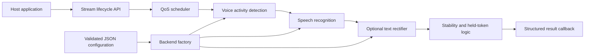

# ears_lib

**A one-day experiment in designing a portable, stream-oriented engine for local AI transcription.**


On April 22, 2026, I explored a systems-design question behind a local dictation app:

> What would a transcription engine look like if streaming, scheduling, model selection, context, and failure handling belonged to a reusable library rather than the application UI?

The result is `ears_lib`, a C++17 prototype for building local transcription pipelines behind one canonical stream API. A host creates a stream, pushes audio, and receives structured results; the library owns the asynchronous pipeline between those two boundaries.

This repository is deliberately presented as an experiment, not a finished speech product. The architecture and core pipeline are implemented, while model integration, packaging, and production verification remain incomplete.

## The idea in one diagram



The host owns microphones, hotkeys, text injection, UI, and operating-system integration. `ears_lib` owns stream state, scheduling, inference orchestration, result ordering, and runtime configuration.

That separation is the central idea: **the application should describe a transcription session without becoming the transcription engine.**

## Implemented in the prototype

- a single asynchronous lifecycle for real-time and batch streams
- per-stream state, ordered callbacks, flushing, and finalization
- latency-critical, latency-sensitive, thermal-constrained, and opportunistic QoS classes
- backpressure and thermal hints
- context profiles and runtime pipeline switching
- VAD → ASR → optional LLM-rectification pipeline composition
- held-word stability logic for incremental transcription
- strict JSON configuration parsing and effective-config export
- stable checksums for resolved runtime configuration
- provider-, runtime-, model-, and fallback-level backend selection
- structured results with timing, confidence, model, provider, and error fields
- per-stream latency and error summaries
- ONNX Runtime adapters for several ASR architecture families
- a dependency-light skeleton mode for developing the orchestration layer without models

The ASR adapter surface covers Whisper-style sequence-to-sequence models, streaming sequence-to-sequence models, CTC, hybrid CTC-attention, RNN-T, and Moonshine-style models. Their maturity varies: the abstraction and selection paths are real, but not every adapter represents a production-verified model integration.

## Canonical API

```cpp
#include <iostream>
#include "ears/ears.hpp"

ears::Config config;
ears::EarsPipeline pipeline(config);

pipeline.set_result_callback([](ears::TranscriptionResult const& result) {
  if (!result.corrected_text.empty()) {
    std::cout << result.corrected_text << '\n';
  }
});

ears::ContextProfile profile;
profile.profile_id = "dictation";
profile.locale = "en";

ears::StreamScheduling scheduling;
scheduling.qos_class = ears::StreamQosClass::latency_critical;
scheduling.trigger_mode = ears::TriggerMode::hold_to_talk;

auto stream = pipeline.create_stream(
    ears::StreamMode::realtime, profile, scheduling);

pipeline.start_stream(stream);

ears::AudioChunk chunk;
chunk.samples = {/* mono 16 kHz floating-point PCM */};
pipeline.push_audio(stream, chunk);

pipeline.flush_stream(stream);
pipeline.end_stream(stream);
```

`push_audio()` reports whether work was accepted; transcription arrives asynchronously through the callback. A flush is both a queue barrier and a request to finalize held text.

## Backend selection

Speech runtimes are treated as replaceable capabilities rather than hard-coded application choices. The factory resolves the most specific available implementation in this order:

```text
provider-specific → runtime-specific → model-family-specific → fallback
```

This makes it possible to describe the desired model family separately from the runtime or accelerator that executes it. The current ONNX path includes CPU, CUDA, and DirectML provider selection; headers for additional native-runtime experiments are also preserved in the prototype.

## Build the orchestration layer

The library can be built without ONNX Runtime or model files. This is useful for inspecting the API, pipeline, configuration, and scheduling code:

```bash
cmake -S . -B build -DEARS_NO_ONNX=ON
cmake --build build
ctest --test-dir build --output-on-failure
```

The repository is mid-rewrite. The skeleton build succeeds, but a small group of factory-selection tests still needs to be reconciled with the no-runtime fallback behavior.

## Build with ONNX Runtime

Provide a local ONNX Runtime installation and configure normally:

```bash
cmake -S . -B build -DONNXRUNTIME_ROOT=/path/to/onnxruntime
cmake --build build --config Release
ctest --test-dir build --build-config Release --output-on-failure
```

CUDA provider support can be requested with `-DEARS_USE_CUDA=ON`. Models, tokenizers, and test audio are intentionally not stored in this repository; configure their local paths in [`config/master.json`](config/master.json).

## Repository map

| Path | Purpose |
| --- | --- |
| [`include/ears/`](include/ears/) | Public stream, configuration, factory, and backend interfaces |
| [`src/pipeline.cpp`](src/pipeline.cpp) | Stream state, worker scheduling, pipeline execution, and result emission |
| [`src/factory.cpp`](src/factory.cpp) | Backend registries and selection precedence |
| [`src/asr/`](src/asr/) | Speech-recognition adapters and decoding helpers |
| [`src/vad/`](src/vad/) | Voice-activity detection implementation |
| [`src/llm/`](src/llm/) | Optional semantic rectification stage |
| [`config/master.json`](config/master.json) | Default runtime configuration |
| [`tests/`](tests/) | Contract, pipeline, configuration, factory, and adapter tests |
| [`docs/ears_lib.md`](docs/ears_lib.md) | Detailed guide to the current rewrite |

## Deliberately outside this repository

`ears_lib` is not the Ears desktop application. It does not contain:

- microphone capture or recording utilities
- global hotkeys or push-to-talk interaction
- keyboard or clipboard text injection
- application UI and settings
- platform-specific host glue
- model weights or downloaded runtime assets

Those responsibilities belong to host applications that consume the library.

## What the experiment demonstrated

The experiment did not prove that a general transcription stack could be completed or productionized in one day. It demonstrated a narrower architectural direction:

- streaming transcription can be expressed through a small host-facing lifecycle
- scheduling and stability policies can live below the application layer
- model family, inference runtime, and hardware provider can be selected independently
- effective configuration can become inspectable, validated runtime state
- model-specific work can evolve without repeatedly redesigning host integrations

The most promising direction is a portable engine that lets multiple local applications share the same transcription contract while choosing different models and execution providers underneath it.

## Status

This repository is a preserved research prototype and an unfinished library rewrite. It is not production-ready, does not provide real-time guarantees, and should not be treated as a complete speech-recognition distribution. The implemented core is intended to make the system design inspectable and resumable without overstating the maturity of its model backends.
